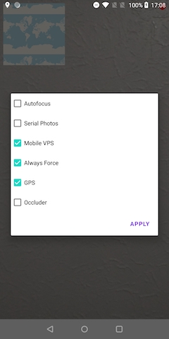

# Sample

Check VPS SDK without visiting real location:
1. Run this **sample** on your ARCore supported device
2. Grant all necessary permissions
3. Make a long tap on a phone display. App should show this debug menu:

    
4. Change settings to:
- Autofocus - check
- GPS - uncheck
5. Click `APPLY` button.
6. In module `sample` find `img` directory and open any image with prefix `loc`. Move the phone camera over the image. Wait until gray circle in the top-right corner become green.
